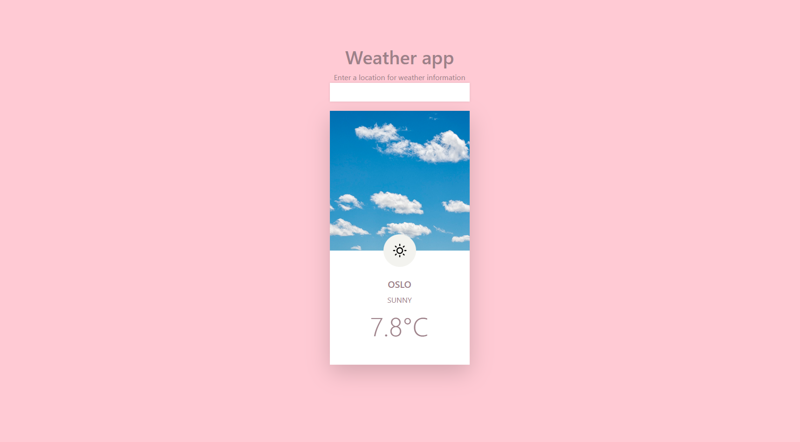

# Weather app
This is a project based on the course Modern JavaScript from NetNinja.

You enter a location into the nput and get back information about weather condition and temperature.

## Used:
- HTML
- CSS, Bootstrap
- JavaScript
- AccuWeather API

